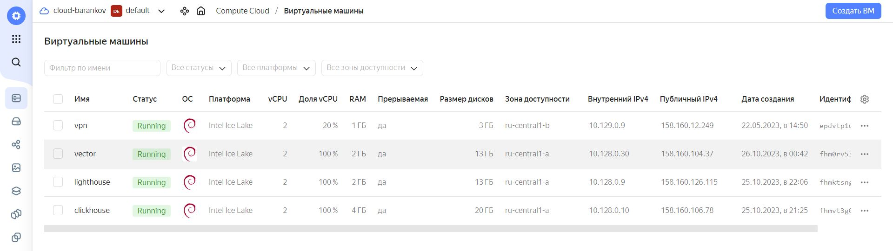
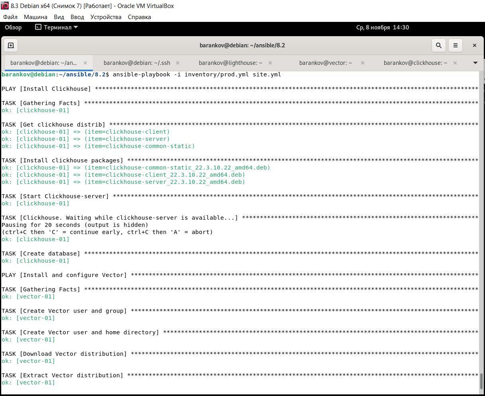
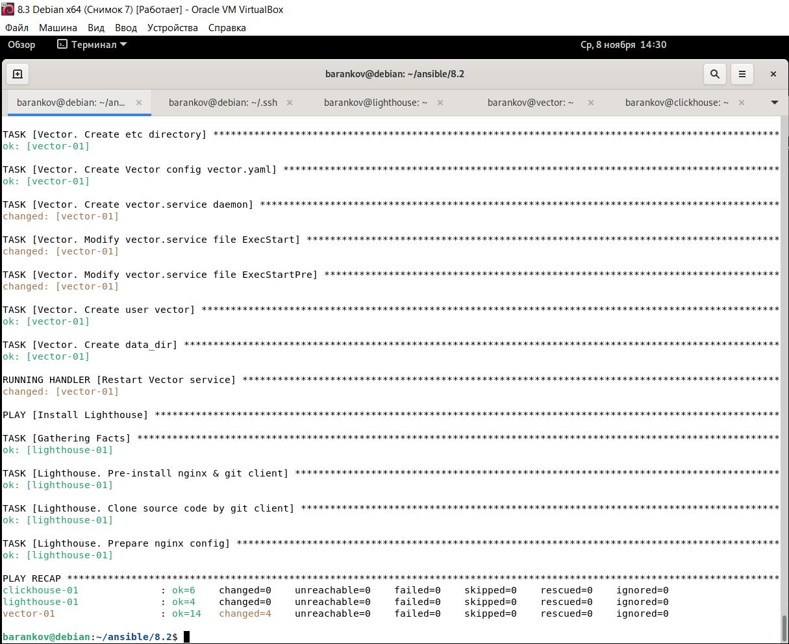
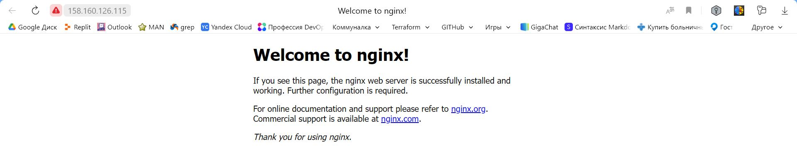
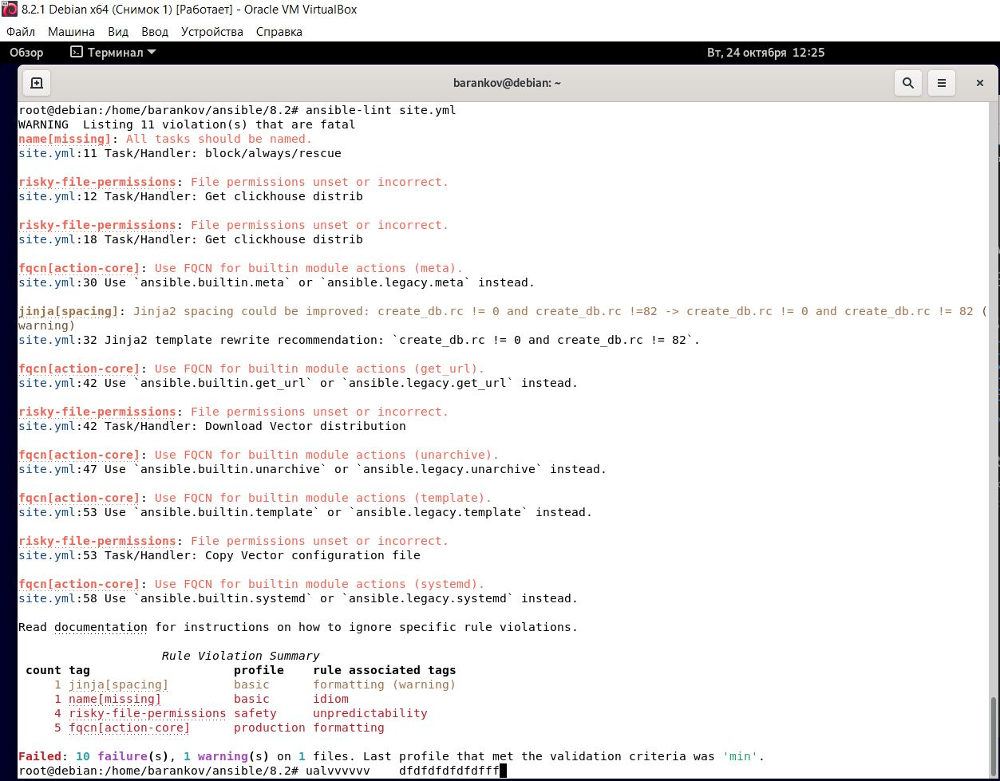

# Домашнее задание к занятию "3. «Использование Ansible»" - Баранков Антон"

1. Допишите playbook: нужно сделать ещё один play, который устанавливает и настраивает LightHouse.
2. При создании tasks рекомендую использовать модули: get_url, template, yum, apt.
3. Tasks должны: скачать статику LightHouse, установить Nginx или любой другой веб-сервер, настроить его конфиг для открытия LightHouse, запустить веб-сервер.
4. Подготовьте свой inventory-файл prod.yml.
5. Запустите ansible-lint site.yml и исправьте ошибки, если они есть.
6. Попробуйте запустить playbook на этом окружении с флагом --check.
7. Запустите playbook на prod.yml окружении с флагом --diff. Убедитесь, что изменения на системе произведены.
8. Повторно запустите playbook с флагом --diff и убедитесь, что playbook идемпотентен..  

Подготовил [playbook](./playbook)

