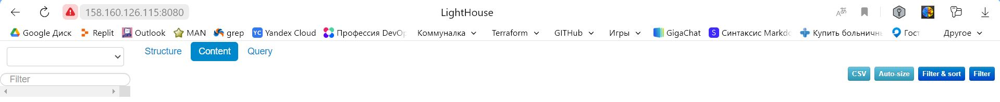

# Домашнее задание к занятию "2. «Работа с Playbook»" - Баранков Антон"

1. Подготовьте свой inventory-файл prod.yml.  

Подготовил [playbook](./playbook)

2. Допишите playbook: нужно сделать ещё один play, который устанавливает и настраивает vector. Конфигурация vector должна деплоиться через template файл jinja2. От вас не требуется использовать все возможности шаблонизатора, просто вставьте стандартный конфиг в template файл. Информация по шаблонам по ссылке.  
3. При создании tasks рекомендую использовать модули: get_url, template, unarchive, file.  
4. Tasks должны: скачать дистрибутив нужной версии, выполнить распаковку в выбранную директорию, установить vector.  
5. Запустите ansible-lint site.yml и исправьте ошибки, если они есть.  

6. Попробуйте запустить playbook на этом окружении с флагом --check.  

Плейбук с флагом --check завершился с ошибкой т.к. нет скачанных файлов для дальнейшего выполнения сценария.  

7. Запустите playbook на prod.yml окружении с флагом --diff. Убедитесь, что изменения на системе произведены.  

8. Повторно запустите playbook с флагом --diff и убедитесь, что playbook идемпотентен.  

